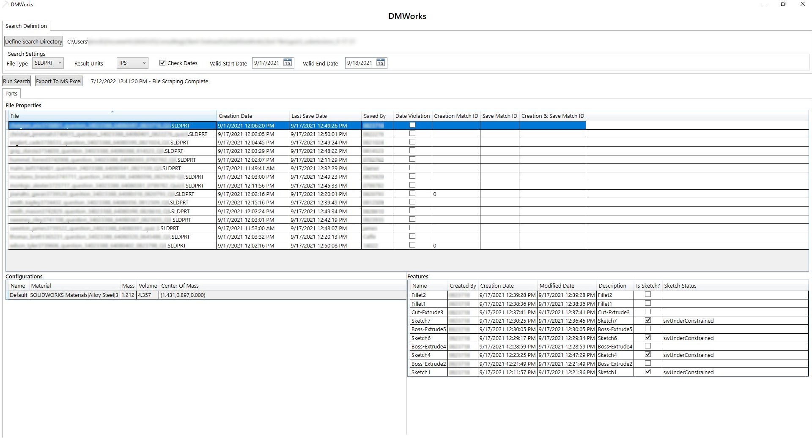

<!--  -->

    

DMWorks is a data scraping tool used to extract data from SOLIDWORKS files.  It was originally developed to scan student submissions for plagiarism in an academic settings.  Other use cases involve applications where the user seeks to extract, consolidate and analyze data contained in SOLIDWORKS files. 

## DMWorks User Experience
DMWorks is a stand-alone application which has the ability to interact with SOLIDWORKS and MS Excel.  Below is an image of the user interface after scanning a directory of SOLIDWORKS *.SLDPRT files.

    

Below are a few items of discussions with respect to the user interface elements.

- Selecting the "Define Search Directory" button allows user to specify a folder containing files to be reviewed.
- Currently only SOLIDWORKS part (*.SLDPRT) files are supported.  Future work includes expanding to include assembly and drawing files.
- Result units control allows for the user to select the output units after the scraping process.  Note that internally SolidWorks holds values in the MKS system.
- The date controls allow users to have the application to check if the files were created/modified within a given window of time.  This was originally developed within an academic setting where the window of time would coincide with an assignment.
- Select the "Run Search" button to initiate the scraping process.  If necessary, the application will startup an instance of SOLIDWORKS and then process files.
- Select the "Export to MS Excel" button to save the data in the grids to an MS Excel workbook.

## Technical Notes
Below are a few more technical items to consider.

- The current code was developed using API references to SOLIDWORKS and MS Excel.
    - SOLIDWORKS version was 2021 which is associated with a version number of 29.  Each year this verion number indexes as expected.  Depending on your installation of SOLIDWORKS, this may need changed at the top of SldWorksFileAgent.cs.
    - Application references the Interop.SldWorks and Interop.SwConst SOLIDWORKS references.
    - Application uses the Microsoft.Office.Interop.Excel reference to interact with MS Excel.

Feel free to reach out to me if you have any questions on the project. 